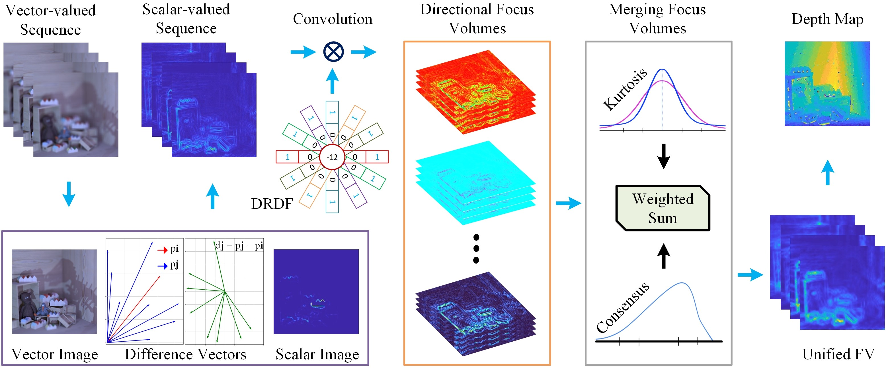

<h1 align="center">A Dual-Stage Focus Measure for Vector-Valued Images in Shape from Focus</h1>

<p align="center">
  <strong><a href="https://khurramashfaq.github.io/">Khurram Ashfaq</a> and Muhammad Tariq Mahmood</strong><br>
  <strong>Pattern Recognition (PR), 2026</strong>
</p>

## [Paper (ScienceDirect/Elsevier)](https://www.sciencedirect.com/science/article/pii/S0031320325007721)



---

## Repository structure

1. `Functions/` contains the relevant MATLAB functions.
2. `Datasets/HCI14/` contains the HCI14 focal stacks used in the paper.
3. `demo.m` provides an example script to run the method.

As sample data, all HCI14 focal stacks used in the paper are provided under `Datasets/HCI14/`.

---

```bibtex
@article{ashfaq2026dual,
  title={A dual-stage focus measure for vector-valued images in shape from focus},
  author={Ashfaq, Khurram and Mahmood, Muhammad Tariq},
  journal={Pattern Recognition},
  volume={170},
  pages={112112},
  year={2026},
  publisher={Elsevier}
}
